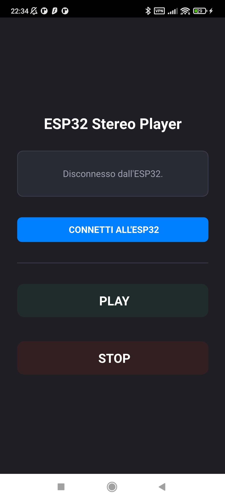

# ESP32 BLE Stereo Manager

Repository ufficiale dell'applicazione di controllo remoto per la riproduzione di file audio tramite tecnologia Bluetooth Low Energy (BLE). Il sistema mette in comunicazione un'interfaccia utente mobile sviluppata in Qt 6 / C++ con un firmware per microcontrollore ESP32 basato sullo stack ottimizzato NimBLE.

## Architettura e Sviluppo del Sistema
Il progetto implementa un'architettura disaccoppiata in cui la logica di business hardware è isolata nel backend nativo in C++, l'interfaccia utente è gestita in modo dichiarativo tramite QML e la ricezione sul target è affidata a un sistema multi-tasking sotto FreeRTOS.
